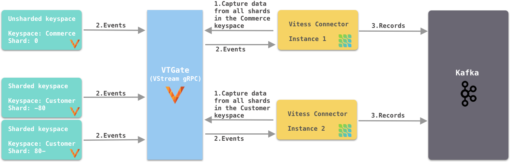
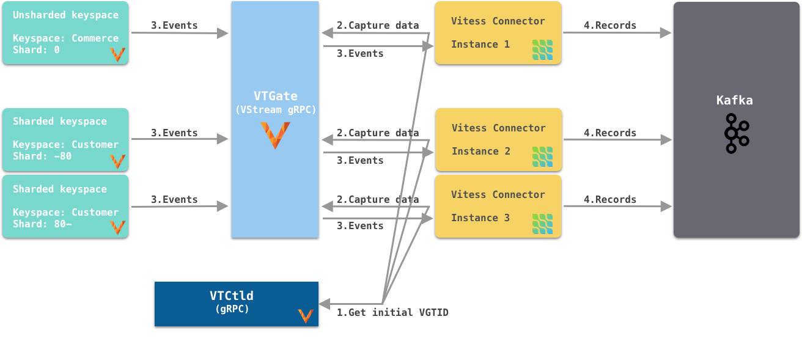
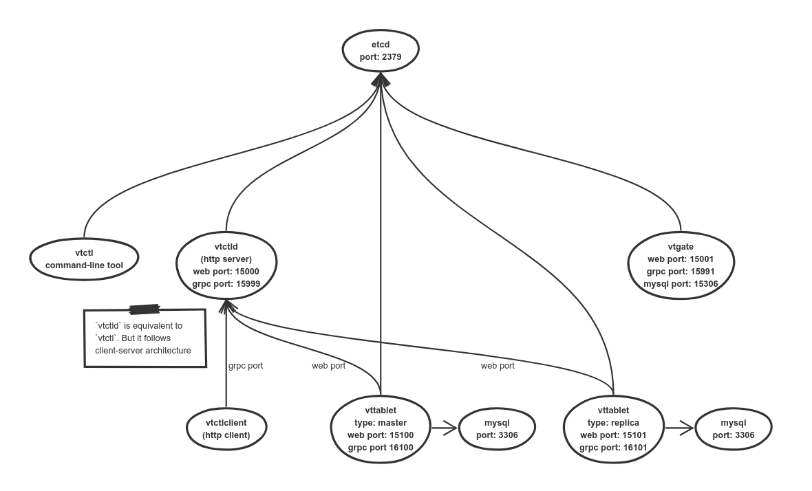
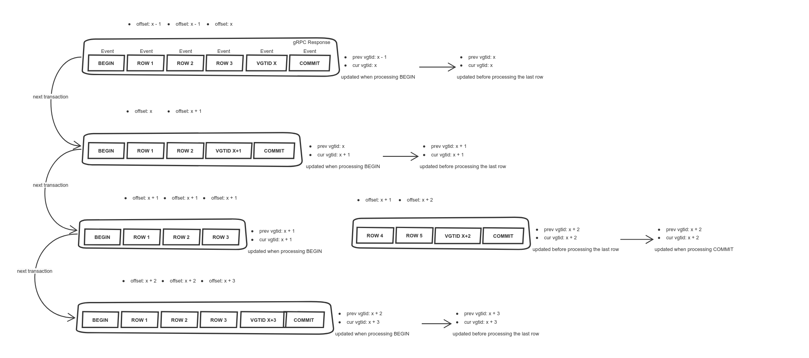

[](http://www.apache.org/licenses/LICENSE-2.0.html)
[](http://search.maven.org/#search%7Cga%7C1%7Cg%3A%22io.debezium%22)
[](https://github.com/debezium/debezium-connector-vitess/actions)
[](https://gitter.im/debezium/user)
[](https://gitter.im/debezium/dev)
[](https://groups.google.com/forum/#!forum/debezium)
[](http://stackoverflow.com/questions/tagged/debezium)

xxxCopyright Debezium Authors.
Licensed under the [Apache License, Version 2.0](http://www.apache.org/licenses/LICENSE-2.0).

# Debezium Connector Vitess

Debezium is an open source project that provides a low latency data streaming platform for change data capture (CDC).

This repository contains incubating connector for [Vitess](https://vitess.io/) which is in an **early stage of its development**.
You are encouraged to explore this connector and test it, but it is not recommended yet for production usage.
E.g. the format of emitted messages may change, specific features may not be implemented yet etc.

## Supported Features

- One connector instance can subscribe to all shards of a given keyspace.
- One connector instance can also choose to subscribe to only 1 shard. However, the vitess `Reshard` operation would be manual in this case.
- Supoort vitess `Reshard` operation when subscribing to all shards of a given keyspace, no data loss, no data duplication.
- Support vitess `MoveTables` operation, no data loss, no data duplication.
- Each transaction has multiple events. All events in the transaction have the same VGTID.
- Support AVRO/JSON connect converters.
- Support extracting only the `after` struct of the message, by using `ExtractNewRecordState` single message transformation (SMT).
- Use async grpc stub for vstream service so that `ChangeEventSourceCoordinator` can be stopped gracefully.
- Vitess Sequence tables also generate events, users can optionally filter them out by `table.exclude.list`.

## Building The Connector

Please see the [README.md](https://github.com/debezium/debezium#building-debezium) in the main repository for general instructions on building Debezium from source (prerequisites, usage of Docker etc).

## Test The Connector

Run `mvn clean install` to automatically build the vitess docker image, start the vitess container, run all integration tests, finally stop the container.
If everything is successful, you can merge your PR.

To build the docker image manually, run `mvn docker:build`. If you want to build from the latest vitess master branch, run `mvn docker:build -Ddocker.nocache=true`.

To start the docker image manually, run `mvn docker:start`. You want to do this when you want to debug your integration tests in an IDE. 
After starting the container, you can run `mysql -h 127.0.0.1 -P 15306` in a terminal to connect to vitess.

To stop the docker image manually, run `mvn docker:stop`.

You can modify certain integration test's behaviour by passing `-Ddebezium.test.*`. For example, with `-Ddebezium.test.records.waittime=5`, the test consumer 
would have 5 seconds to consume all expected `SourceRecord` before fail the test.

## How Vitess Connector Works

Each connector instance captures data-changes from all shards in a keyspace, or from a specific shard in a keyspace.

If you subscribe to all shards, no VTCtld is needed to get the initial vgtid.


If you subscribe to a specific shard, connectors communicate with the VTCtld to get the initial (a.k.a. the current) vgtid position of the keyspace/shard.


Internally, each connector constantly polls data-changes from VStream gRPC and send them to an in-memory queue.
Connector task polls data-changes from the queue. See below:


The following is the vitess architecture within a specific cell (a.k.a. data center or AZ in AWS term):


## Managing Offset

Offsets are stored in the `_connect_offsets` topic.

The partition key is of format
```json
[
    "<connector_name>",
    {
        "server": "<database.server.name>"
    }
]
```

E.g.
```json
[
    "sample_multi_shard_connector",
    {
        "server": "connect_vitess_customer_sharded"
    }
]
```

The value is of format
```json
{
    "transaction_id": null,
    "vgtid": "<vgtid_in_json>"
}
```

E.g.
```json
{
    "transaction_id": null,
    "vgtid": "[{\"keyspace\":\"customer\",\"shard\":\"80-\",\"gtid\":\"MariaDB/0-54610504-45\"},{\"keyspace\":\"customer\",\"shard\":\"-80\",\"gtid\":\"MariaDB/0-1592148-41\"}]"
}
```

allows the connector to start reading from `MariaDB/0-54610504-46` (inclusive) from the `80-` shard and `MariaDB/0-1592148-42`
(inclusive) from the `-80` shard, from the `commerce` keyspace.

The following diagram shows how each record's offset is managed:


## MySQL Transactions AND gRPC Responses

Each MySQL transaction (e.g. inserting a few rows in a transaction) can emit multiple gRPC responses.
Each gRPC response contains multiple events. For example.

```
Insert 1 row
======response======
event: BEGIN
event: FIELD
event: ROW
event: VGTID (x)
event: COMMIT

Apply 1 DDL
======response======
event: VGTID (x + 1)
event: DDL

======response======
event: BEGIN
event: VERSION

======response======
event: VGTID (x + 2)
event: COMMIT

Insert more rows in 1 transaction, each ROW event has multiple rows
======next response======
event: BEGIN
event: FIELD
event: ROW
event: ROW
event: VGTID (x + 3)
event: COMMIT
```

## Vitess MoveTables Workflow

Vitess's `MoveTables` workflow move a table from one keyspace to another.

The vitess-connector supports this workflow. No data lose, nor data duplication for the connector that copies from the source keyspace.

The entire history of the moved table will be replicated to another connector if the later is replicating from the target keyspace.

## Vitess Reshard

Vitess's `Reshard` operation copies data from the source shards into the target shards, then remove the source shards.

### Recommended way
The vitess-connector automatically supports Reshard if it subscribes to all shards in the keyspace.
No data lose, nor data duplication will happen during the reshard operation.
After the `SwitchWrites` of the Reshard and before deleting the source shards, make sure that the connector is not down and the offset
topic has the new VGTID from the target shards. Otherwise, if the source shards are already deleted, VStream will throw an error when reading 
from the old VGTID from the source shards.

### Manual way
When subscribing to individual shard, we need to do the following manual steps for reshard.

- Create 1 new connector per target shards, e.g. `commerce/-80` and `commerce/80-`. It is ok to run the new connector even before resharding.
- Because they're new connectors, new topics will be created.
- The source shard's connector `-` will keep sending events of all shards to old topics, until the source shard is removed.

## Contributing

The Debezium community welcomes anyone that wants to help out in any way, whether that includes reporting problems, helping with documentation, or contributing code changes to fix bugs, add tests, or implement new features. See [this document](https://github.com/debezium/debezium/blob/master/CONTRIBUTE.md) for details.

### Building just the artifacts, without running tests, CheckStyle, etc.

You can skip all non-essential plug-ins (tests, integration tests, CheckStyle, formatter, API compatibility check, etc.) using the "quick" build profile:

    $ mvn clean verify -Dquick

This provides the fastes way for solely producing the output artifacts, without running any of the QA related Maven plug-ins.
This comes in handy for producing connector JARs and/or archives as quickly as possible, e.g. for manual testing in Kafka Connect.
