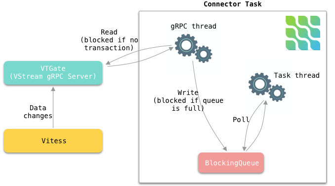

[](http://www.apache.org/licenses/LICENSE-2.0.html)
[](http://search.maven.org/#search%7Cga%7C1%7Cg%3A%22io.debezium%22)
[](https://travis-ci.com/debezium/debezium-connector-vitess/)
[](https://gitter.im/debezium/user)
[](https://gitter.im/debezium/dev)
[](https://groups.google.com/forum/#!forum/debezium)
[](http://stackoverflow.com/questions/tagged/debezium)

Copyright Debezium Authors.
Licensed under the [Apache License, Version 2.0](http://www.apache.org/licenses/LICENSE-2.0).

# Debezium Connector Vitess

Debezium is an open source project that provides a low latency data streaming platform for change data capture (CDC).

This repository contains incubating connector for [Vitess](https://vitess.io/) which is in an **early stage of its development**.
You are encouraged to explore this connector and test it, but it is not recommended yet for production usage.
E.g. the format of emitted messages may change, specific features may not be implemented yet etc.

## Supported Features

- Get the latest VGTID of a specific shard from VTCtld (via gRPC).
- Constantly get data-changes of a specific shard from VTGate (via gRPC, a.k.a VStream).
- Each transaction has multiple events. All events in the transaction have the same VGTID.
- Support basic MySQL type -> Kafka Connect type mapping.
- Support AVRO/JSON connect converters.
- Support extracting only the `after` struct of the message, by using `ExtractNewRecordState` single message transformation (SMT).
- If for any reason, a message in a transaction fails the task, we can restart from the offset where it has left off.
- If no previous offset exists, start from the latest vgtid of the specified shard.
- Mapping vitess table to kafka topics (e.g. Mapping vitess table `product` in `commerce` keyspace to kafka topic `connect_vitess_commerce_shard_0.commerce.product`, `connect_vitess_commerce_shard_0` is the `database.server.name` connector config)
- Use async grpc stub for vstream service so that `ChangeEventSourceCoordinator` can be stopped gracefully
- Some configurations supported out-of-the-box from Debezium Development Framework.
    - database.server.name ✅
    - table.include.list ✅
    - table.exclude.list ✅
    - column.include.list ✅
    - message.key.columns ✅
    - tombstones.on.delete ✅ (was limited by missing primary key in VStream API, so need to be used with `message.key.columns`, but now they've added support for this, so it's in the TODOs)
    - max.queue.size ✅
    - max.batch.size ✅
    - poll.interval.ms ✅
    - event.processing.failure.handling.mode ✅
    - converters ✅
- Support vitess `MoveTables` workflow, no data loss, no data duplication.
- Vitess Sequence tables also generate events, users can optionally filter them out by `table.exclude.list`.

## Future Improvements

- Support vitess resharding operation
- Add primary key to message. A workaround at the moment is using `message.key.columns` configuration.
- Support for initial database snapshot
- Support `decimal.handling.mode` configuration. (It was limited by VStream API, but now Vitess has added support for this.) 
- Support `time.precision.mode` configuration.
- Support nullable columns. At the moment, all columns are nullable.
- Add authentication to VTGate gRPC

## Building The Connector

Please see the [README.md](https://github.com/debezium/debezium#building-debezium) in the main repository for general instructions on building Debezium from source (prerequisites, usage of Docker etc).

## Test The Connector

Run `mvn clean install` to automatically build the vitess docker image, start the vitess container, run all integration tests, finally stop the container.
If everything is successful, you can merge your PR.

To build the docker image manually, run `mvn docker:build`. If you want to build from the latest vitess master branch, run `mvn docker:build -Ddocker.nocache=true`.

To start the docker image manually, run `mvn docker:start`. You want to do this when you want to debug your integration tests in an IDE. 
After starting the container, you can run `mysql -h 127.0.0.1 -P 15306` in a terminal to connect to vitess.

To stop the docker image manually, run `mvn docker:stop`.

You can modify certain integration test's behaviour by passing `-Ddebezium.test.*`. For example, with `-Ddebezium.test.records.waittime=5`, the test consumer 
would have 5 seconds to consume all expected `SourceRecord` before fail the test.

## How Vitess Connector Works

Each connector instance captures data-changes from a specific keyspace/shard.
To get the initial (a.k.a. the latest) vgtid position of the keyspace/shard, connectors communicate with the VTCtld.


Internally, each connector constantly polls data-changes from VStream gRPC and send them to an in-memory queue.
Connector task polls data-changes from the queue. See below:


The following is the vitess architecture within a specific cell (a.k.a. data center or AZ in AWS term):


## Supported Streaming Metrics

The MBean is `debezium.vitess:type=connector-metrics,context=binlog,server=<database.server.name>`.

| MBean Attribute Name          | Type    | Description                                                                                                                                                         |
| ----------------------------- | ------- | ------------------------------------------------------------------------------------------------------------------------------------------------------------------- |
| Connected                     | boolean | Flag that denotes whether the connector is currently connected to the database server.                                                                              |
| NumberOfCommittedTransactions | long    | The number of processed transactions that were committed.                                                                                                           |
| QueueTotalCapacity            | int     | The length the queue used to pass events between the streamer and the main Kafka Connect loop.                                                                      |
| QueueRemainingCapacity        | int     | The free capacity of the queue used to pass events between the streamer and the main Kafka Connect loop.                                                            |
| TotalNumberOfEventsSeen       | long    | The total number of events that this connector has seen since last started or reset, including filtered, error, normal row-change events. Not including DDL events. |
| NumberOfEventsFiltered        | long    | The number of events that have been filtered by include/exclude list filtering rules configured on the connector.                                                 |
| MilliSecondsBehindSource      | long    | The number of milliseconds between the last change event’s timestamp (a.k.a. commit time) and the connector processing it.                                          |
| MilliSecondsSinceLastEvent    | long    | The number of milliseconds since the connector has read and processed the most recent event.                                                                        |

## Data Types

- **Vitess gRPC column type** : column type returned by Vitess gRPC
- **literal type** : how the value is represented using Kafka Connect schema types
- **semantic type** : how the Kafka Connect schema captures the meaning of the field (schema name)

| MySQL type | Vitess gRPC column type | Literal type | Semantic type |
| ---------- | ----------------------- | ------------ | ------------- |
| BOOLEAN    | INT8                    | INT16        | n/a           |
| TINYINT    | INT8                    | INT16        | n/a           |
| SMALLINT   | INT16                   | INT16        | n/a           |
| MEDIUMINT  | INT24                   | INT32        | n/a           |
| INT        | INT32                   | INT32        | n/a           |
| BIGINT     | INT64                   | INT64        | n/a           |
| REAL       |                         |              | n/a           |
| FLOAT      | FLOAT32                 | FLOAT64      | n/a           |
| DOUBLE     | FLOAT64                 | FLOAT64      | n/a           |
| BIT        |                         |              |               |
| CHAR       | CHAR                    | STRING       | n/a           |
| VARCHAR    | VARCHAR                 | STRING       | n/a           |
| BINARY     | BINARY                  | STRING       | n/a           |
| VARBINARY  | VARBINARY               | STRING       | n/a           |
| TINYBLOB   |                         |              |               |
| TINYTEXT   |                         |              |               |
| BLOB       |                         |              |               |
| TEXT       | TEXT                    | STRING       | n/a           |
| MEDIUMBLOB |                         |              |               |
| MEDIUMTEXT | TEXT                    | STRING       | n/a           |
| LONGBLOB   |                         |              |               |
| LONGTEXT   | TEXT                    | STRING       | n/a           |
| JSON       | JSON                    |              |               |
| ENUM       | ENUM                    | STRING       | ordinals      |
| SET        | SET                     | STRING       | ordinals      |
| YEAR       | YEAR                    | STRING       |               |
| TIMESTAMP  | TIMESTAMP               | STRING       |               |
| DATETIME   | DATETIME                | STRING       |               |
| DATE       | DATE                    | STRING       |               |
| TIME       | TIME                    | STRING       |               |
| DECIMAL    | DECIMAL                 | STRING       |               |

Inserting a row in the following table

```bash
mysql> desc type_table;
+----------------+--------------------------------+------+-----+---------------------+----------------+
| Field          | Type                           | Null | Key | Default             | Extra          |
+----------------+--------------------------------+------+-----+---------------------+----------------+
| type_id        | bigint(20)                     | NO   | PRI | NULL                | auto_increment |
| tinyint1_col   | tinyint(1)                     | YES  |     | 1                   |                |
| smallint_col   | smallint(5)                    | YES  |     | 1                   |                |
| mediumint_col  | mediumint(8)                   | YES  |     | 1                   |                |
| int_col        | int(10)                        | YES  |     | 1                   |                |
| float_col      | float                          | YES  |     | 1.2                 |                |
| double_col     | double                         | YES  |     | 1.2                 |                |
| decimal_col    | decimal(10,4)                  | NO   |     | 1.0000              |                |
| time_col       | time                           | NO   |     | 00:00:00            |                |
| date_col       | date                           | NO   |     | 2020-02-12          |                |
| datetime_col   | datetime                       | NO   |     | 2020-02-12 00:00:00 |                |
| created        | timestamp                      | NO   |     | CURRENT_TIMESTAMP   |                |
| char_col       | char(2)                        | NO   |     | ee                  |                |
| varchar_col    | varchar(255)                   | NO   |     | foo                 |                |
| text_col       | text                           | YES  |     | NULL                |                |
| mediumtext_col | mediumtext                     | YES  |     | NULL                |                |
| longtext_col   | longtext                       | NO   |     | NULL                |                |
| json_col       | json                           | YES  |     | NULL                |                |
| binary_col     | binary(255)                    | YES  |     | NULL                |                |
| varbinary_col  | varbinary(12)                  | YES  |     | NULL                |                |
| enum_col       | enum('small','medium','large') | NO   |     | medium              |                |
| set_col        | set('a','b','c','d')           | NO   |     | b                   |                |
+----------------+--------------------------------+------+-----+---------------------+----------------+
```

would send the following record to the `connect_vitess_commerce_unsharded.commerce.type_table` topic, where `connect_vitess_commerce_unsharded` is the `database.server.name`:

```json
{
  "before" : null,
  "after" : {
    "type_id" : 1,
    "tinyint1_col" : 1,
    "smallint_col" : 1,
    "mediumint_col" : 1,
    "int_col" : 1,
    "float_col" : 12345.9873046875,
    "double_col" : 12345.987654321,
    "decimal_col" : "1.0000",
    "time_col" : "00:00:00",
    "date_col" : "2020-02-12",
    "datetime_col" : "2020-02-12 00:00:00",
    "created" : "2020-07-16 13:55:55",
    "char_col" : "ee",
    "varchar_col" : "foo",
    "text_col" : "foo_text",
    "mediumtext_col" : "foo_mediumtext",
    "longtext_col" : "foo_longtext",
    "json_col" : "JSON_OBJECT('foo_json',1)",
    "binary_col" : "foo_binary\u0000\u0000",
    "varbinary_col" : "foo_varbinary",
    "enum_col" : "2",
    "set_col" : "2"
  },
  "source" : {
    "version" : "0.0.1-SNAPSHOT",
    "connector" : "vitess",
    "name" : "connect_vitess_commerce_unsharded",
    "ts_ms" : 1594907755000,
    "snapshot" : "false",
    "db" : "connect_vitess_commerce_unsharded",
    "schema" : "commerce",
    "table" : "type_table",
    "vgtid_keyspace" : "commerce",
    "vgtid_shard" : "-",
    "vgtid_gtid" : "MySQL56/28c2a56b-c76a-11ea-822f-0242ac11000a:1-31"
  },
  "op" : "c",
  "ts_ms" : 1594907755121,
  "transaction" : null
}
```

## Schema Migration

| Entity | Description                                                     | Rows from older binlog                     | Rows from newer binlog                                    |
| ------ | --------------------------------------------------------------- | ------------------------------------------ | --------------------------------------------------------- |
| Table  | Rename table                                                    | [ok] rows have old table name              | [ok] rows have new table name                             |
| Table  | Drop column                                                     | [ok] include the dropped column            | [ok] does not include the dropped column                  |
| Table  | Add column to the end                                           | [ok] does not include the added column     | [ok] include the new column                               |
| Table  | Add column in the middle                                        | [ok] does not include the added column     | [ok] include the new column, old columns are not replaced |
| Column | Reame column                                                    | [ok] column is not renamed                 | [ok] include the column with new name                     |
| Column | Change column type (e.g. int to bigint)                         | [ok] column type is not changed            | [ok] column type is nullable `long`                       |
| Column | Change column default (e.g. bigint, keep nullable, add default) | [ok] no nullable or default value metadata | [ok] no nullable or default value metadata                |

## Managing Offset

Offsets are stored in the `_connect_offsets` topic.

The partition key is of format
```json
[
    "<connector_name>",
    {
        "server": "<database.server.name>"
    }
]
```

E.g.
```json
[
    "sample_connector",
    {
        "server": "connect_vitess_commerce_unsharded"
    }
]
```

The value is of format
```json
{
    "vgtid_gtid": "<gtid>",
    "transaction_id": null,
    "vgtid_keyspace": "<keyspace>",
    "vgtid_shard": "<shard>",
    "event":"<number_of_row_events_to_skip>"
}
```

E.g.
```json
{
    "vgtid_gtid": "MySQL56/cebc0300-c5b4-11ea-90ec-0242ac110009:1-33",
    "transaction_id": null,
    "vgtid_keyspace": "commerce",
    "vgtid_shard": "-",
    "event": 1
}
```

allows the connector to start reading from `MySQL56/cebc0300-c5b4-11ea-90ec-0242ac110009:34` (because `1-33` are already read) from the `commerce` keyspace's `-` shard. The connector will skip 1 row-event as description by the `event`, it is because this row-event has already been already processed and sent to the data topic.

The following diagram shows how each record's offset is managed:


## MySQL Transactions AND gRPC Responses

Each MySQL transaction (e.g. inserting a few rows in a transaction) can emit multiple gRPC responses.
Each gRPC response contains multiple events. For example.

```
Insert 1 row
======response======
event: BEGIN
event: FIELD
event: ROW
event: VGTID (x)
event: COMMIT

Apply 1 DDL
======response======
event: VGTID (x + 1)
event: DDL

======response======
event: BEGIN
event: VERSION

======response======
event: VGTID (x + 2)
event: COMMIT

Insert more rows in 1 transaction, each ROW event has multiple rows
======next response======
event: BEGIN
event: FIELD
event: ROW
event: ROW
event: VGTID (x + 3)
event: COMMIT
```

## Vitess MoveTables Workflow

Vitess's `MoveTables` workflow move a table from one keyspace to another.

The vitess-connector supports this workflow. No data lose, nor data duplication for the connector that copies from the source keyspace.

The entire history of the moved table will be replicated to another connector if the later is replicating from the target keyspace.

## Vitess Resharding

This is not fully supported. You will get an error `Only 1 shard gtid per vgtid is allowed` from the connector who listens to the source shard `-`.

A few reasons why it is not supported yet:

- The current design of the connector's offset management supports only 1 shard_gtid at moment. The connector that listens to the `-` shard will receive VGTID event that contains multiple `shard_gtids` when resharding.
- Upon connector restart, we need to subscribe to a vgtid with multiple `shard_gtids`, this way, we can start from where we left off from the entire keyspace.

One manual way to support Vitess Reshard:

- Create 1 new connector per target shards, e.g. `commerce/-80` and `commerce/80-`. It is ok to run the new connector even before resharding.
- Because they're new connectors, new topics will be created.
- The source shard's connector `-` will keep sending events of all shards to old topics.

## Contributing

The Debezium community welcomes anyone that wants to help out in any way, whether that includes reporting problems, helping with documentation, or contributing code changes to fix bugs, add tests, or implement new features. See [this document](https://github.com/debezium/debezium/blob/master/CONTRIBUTE.md) for details.
